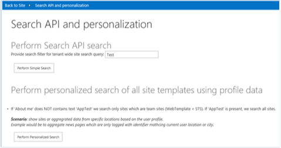
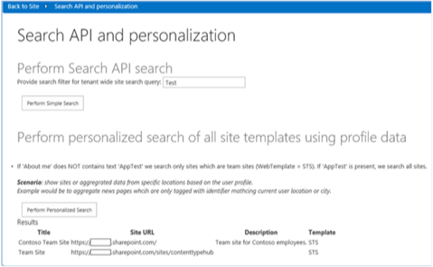
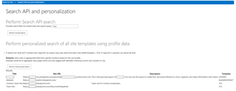

# Personalize search results sample SharePoint Add-in

The Search.PersonalizedResults sample shows you how to personalize SharePoint by filtering information based on the value of a user profile property. Some examples of personalization include:

- News articles or other content filtered by country or location.
- Navigation links filtered based on the user's role or organization.
- Restaurants or retail outlet listings based on the location of your place of business.

This code sample uses a provider-hosted add-in to display search results to the user that include either all sites or only team sites that the user has access to. To do this, the sample:

- Checks the value of the **AboutMe** user profile property.
- Builds a search query filter string associated with the value of the **AboutMe** user profile property.
- Runs the search query and displays the search query results.

## Before you begin

To get started, download the [Search.PersonalizedResults](https://github.com/SharePoint/PnP/tree/master/Samples/Search.PersonalizedResults) sample add-in from the Office 365 Developer Patterns and Practices project on GitHub.

> [!NOTE]
> The code in this article is provided as-is, without warranty of any kind, either express or implied, including any implied warranties of fitness for a particular purpose, merchantability, or non-infringement.

## Using the Search.PersonalizedResults sample add-in

When you run this code sample, a provider-hosted application appears.



This article describes the **Perform personalized search of all site templates using profile data** scenario. Choosing **Perform Personalized Search** returns filtered search results that contain team sites only, as shown in the following figure. Notice that the **Template** column contains sites of type **STS** only.



For handling personalization scenarios, you can change the search query by:

- Reading and testing the value of a user profile property for that user. This code sample tests the **About Me** property for a value of **AppTest**.

- Taking a specific course of action based on the value of the user profile property. For example, if the value of the **About Me** user profile property is **AppTest**, this code sample removes the team site filter and returns search results that contain all sites.

### Enter AppTest in the About Me user profile property

1. At the top of your Office 365 site, choose your profile picture, and then choose **About Me**.

   

2. On the **About me** page, choose **edit your profile**.

3. In **About me**, enter **AppTest**.

4. Choose **Save all and close**.

### Perform personalized search

Return to the **Search.PersonalizedResults** provider-hosted add-in and choose **Perform Personalized Search** again. The add-in changes the filter on the search query to show all sites instead of team sites only, as shown in the following figure. The **Template** column now contains several different site template types.



In default.aspx.cs, choosing **Perform Personalized Search** calls the **btnPersonalizedSearch\_Click** method, which performs the following actions:

- Uses **PeopleManager** to get all user profile properties for the user running this add-in.

- Retrieves and checks the value of the **AboutMe** user profile property. If the value of the **AboutMe** property is **AppTest**, the search query retrieves all sites by using the query string  `contentclass:"STS_Site"`. If the value of the **AboutMe** property isn't **AppTest**, the team site filter is appended to the query string (`WebTemplate=STS`), and the search query retrieves team sites only.

- Calls the **ProcessQuery** method to retrieve the search results based on the supplied query string. **ProcessQuery** also demonstrates how to specify a list of properties to return with the search results.

- Calls the **FormatResults** method to format the search results into an HTML table.


```csharp
protected void btnPersonalizedSearch_Click(object sender, EventArgs e)
        {
            var spContext = SharePointContextProvider.Current.GetSharePointContext(Context);

            using (var clientContext = spContext.CreateUserClientContextForSPHost())
            {
                // Load user profile properties.
                PeopleManager peopleManager = new PeopleManager(clientContext);
                PersonProperties personProperties = peopleManager.GetMyProperties();
                clientContext.Load(personProperties);
                clientContext.ExecuteQuery();
                // Check the value of About Me.
                string aboutMeValue = personProperties.UserProfileProperties["AboutMe"];
                string templateFilter = ResolveAdditionalFilter(aboutMeValue);
                // Build the query string.
                string query = "contentclass:\"STS_Site\" " + templateFilter;
                ClientResult<ResultTableCollection> results = ProcessQuery(clientContext, query);
                lblStatus2.Text = FormatResults(results);
            }
        }

private ClientResult<ResultTableCollection> ProcessQuery(ClientContext ctx, string keywordQueryValue)
        {
            KeywordQuery keywordQuery = new KeywordQuery(ctx);
            keywordQuery.QueryText = keywordQueryValue;
            keywordQuery.RowLimit = 500;
            keywordQuery.StartRow = 0;
            keywordQuery.SelectProperties.Add("Title");
            keywordQuery.SelectProperties.Add("SPSiteUrl");
            keywordQuery.SelectProperties.Add("Description");
            keywordQuery.SelectProperties.Add("WebTemplate");
            keywordQuery.SortList.Add("SPSiteUrl", Microsoft.SharePoint.Client.Search.Query.SortDirection.Ascending);
            SearchExecutor searchExec = new SearchExecutor(ctx);
            ClientResult<ResultTableCollection> results = searchExec.ExecuteQuery(keywordQuery);
            ctx.ExecuteQuery();
            return results;
        }
```

## See also

- [UserProfile.Manipulation.CSOM](https://github.com/SharePoint/PnP/tree/master/Samples/UserProfile.Manipulation.CSOM)
- [UserProfile.Manipulation.CSOM.Console](https://github.com/SharePoint/PnP/tree/master/Samples/UserProfile.Manipulation.CSOM.Console)
- [Core.ProfileProperty.Migration](https://github.com/SharePoint/PnP/tree/master/Samples/Core.ProfileProperty.Migration)
- [User profile solutions for SharePoint](user-profile-solutions-for-sharepoint.md)
