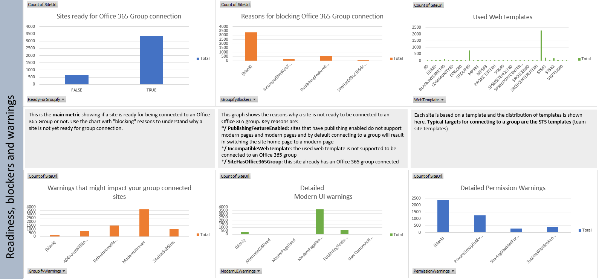
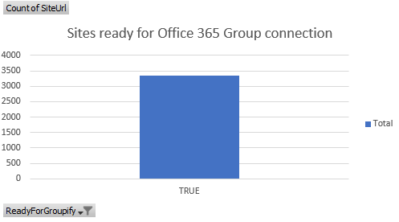
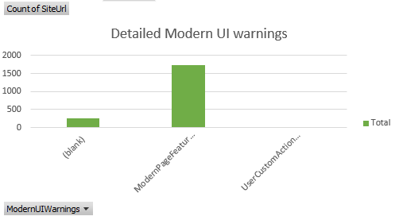
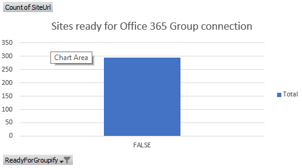
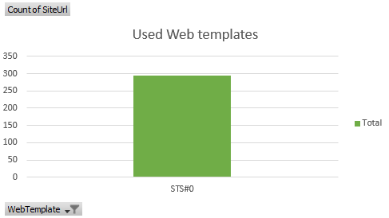
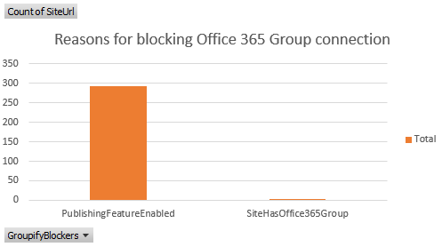

# Analyze and use the scanner data: Connect to Office 365

To help you understand which sites are ready to be group-connected, you can use the [SharePoint Modernization Scanner](https://aka.ms/sppnp-modernizationscanner) to analyze your environment. Use this article to understand how you can use the scanner output to prepare your sites for being connected to a Microsoft 365 group. The scanner, as of version 1.5, will generate an Excel report plus several CSV files. It's recommended to use the Excel based dashboard to review the scanner data and when needed use the CSV data for more in depth data.

## Using the "Microsoft 365 group Connection Readiness" report

The "Microsoft 365 group Connection Readiness" report is an Excel based dashboard that allows you to make informed decisions on which sites are ready for Microsoft 365 group connection. For the sites that are not ready the dashboard will help you understand why a site is not ready. The dashboard has a number of slicers on top that you can use to filter the data:

The filtered data is then presented in a number of charts:

## Understand which sites are ready for Microsoft 365 group connection

Apply the following filter and confirm the "Sites ready for Microsoft 365 group connection" shows only TRUE:

Filter | Validation
---------|----------
 | 

To obtain the actual list of sites (e.g. for input towards the "bulk Microsoft 365 group connection" scripts) you can follow these steps:

- Right click the **Dashboard** tab in Excel, click **Unhide** and select the **ReadyForGroupify** sheet
- Set the table filter of column B (ReadyForGroupify) to TRUE and you've the list of sites

At this point you have a list of all sites which can be connected to a Microsoft 365 group, but you still might want to filter out some sites based upon the web template and possible warnings found. Let's start with the web template: the key site to connect to a Microsoft 365 group is the "classic" team site, so let's filter on those first:

Filter | Validation
---------|----------
 | 

With that filter applied let's have a look at the typical warnings:

### Microsoft 365 group Connection Warnings

- **SiteHasSubSites**: A group is connected to the root site of the site collection and not to individual sub sites. In the modern team and communication sites, the use of subsites is de-emphasized but having sub sites is fully supported. Important to understand is that you can't use group connected services on your sub sites.
- **ModernUIIssues**: Since connecting to a group brings a modern home page this might result in existing customizations being "ignored" on that modern home page. The details of which modern UI issues were found by the scanner can be found in the next section. You can optionally stick with your "current" home page if you run Microsoft 365 group connection using the API's or using the "Bulk Microsoft 365 group connection" scripts.
- **DefaultHomePageImpacted**: The default home page based upon this site's web template differs a lot from the new home page you get by connecting to a group. You can optionally stick with your "current" home page if you run Microsoft 365 group connection using the API's or using the "bulk Microsoft 365 group connection" scripts. Another alternative is creating a new modern home page, as is shown in the "Bulk Microsoft 365 group connection" script.
- **ADGroupWillNotBeExpanded**: When you group-connect via the user interface, you have an option to define the Microsoft 365 group's owners and members; when you bulk group-connect, the sample script explained later does the same. However, because a Microsoft 365 group can only contain persons as Owners or Members, this means that if today you granted access to your SharePoint site by using an Azure Active Directory (Azure AD) security group, you can't add that Azure AD security group as a Microsoft 365 group owner or member. If you want to only rely on the permissions defined on the Microsoft 365 group, you must add all individual Azure AD group members as part of the group-connection process, but having identical access defined on both the SharePoint site and the Microsoft 365 group is not needed, making this not a blocking issue.

### Modern UI Warnings

- **MasterPageUsed** or **AlternateCSSUsed**: Custom master pages or alternate CSS is not used on modern pages. If your site depends on these, you might want to verify that, because your custom master pages and CSS will not work on the modern home page that the site gets. Checkout the [Modernize branding](modernize-branding.md) article to learn more on the possible remediation steps.
- **UserCustomActionUsed**: Using user custom actions that embed JavaScript is common for customizing sites, but this does not work for modern pages. If you have user custom actions, you can build alternatives by using SharePoint Framework Extensions and install those to your site. See the ModernizationUserCustomActionScanResults.csv and checkout the [Modernize customizations](modernize-customizations.md) article for more details.
- **PublishingFeatureEnabled**: The publishing features are not compatible with the modern page feature, which is a requirement due to the modern home page being set. If the publishing capabilities are not used on your site then you can disable them.
- **ModernPageFeatureDisabled**: Because the site gets a modern home page after group-connection creation, it's important that the modern homepage feature is enabled. Use the remediation steps outlined in [Transform classic pages to modern pages](modernize-userinterface-site-pages.md) to fix this.
- **ModernListsBlockedAtSiteLevel** or **ModernListsBlockedAtWebLevel**: Preventing the modern user interface for lists and libraries is not blocking group-connection, but because group-connection is typically part of a site modernization, it makes no sense to prevent lists and libraries to use the modern user interface on a Microsoft 365 group-connected site. Use the remediation steps outlined in [Maximize use of modern lists and libraries](modernize-userinterface-lists-and-libraries.md) to fix this.

### Permission Warnings

- **SharingDisabledForSiteButGroupWillAllowExternalSharing**: The default configuration for Microsoft 365 group-connected sites is to allow sharing with externals, but you might have disabled sharing with externals for your site. It's recommended to sync the SharePoint site external sharing settings with the settings of the connected Microsoft 365 group.
- **PrivateGroupButEveryoneUsedOutsideOfAdminOwnerMemberGroups**: The scanner proposes to create the group either as private or public, and it does this based on the existence of the everyone claims inside the SharePoint site's administrators, owners, or members groups. However, you may have used the everyone claims outside of these groups, which is indicated by this warning. Typically this is fine, use this warning to evaluate whether you want to change a group from private to public.
- **SubSiteWithBrokenPermissionInheritance**: If you have subsites with unique permissions, these do not inherit the permissions defined on the connected Microsoft 365 group. Since Office 365 services that come via the group do not apply to sub sites this typically is not an issue.

## Understand which sites are not ready for Microsoft 365 group connection

Apply the following filter and confirm the "Sites ready for Microsoft 365 group connection" shows only FALSE:

Filter | Validation
---------|----------
 | 

At this point you have a list of all sites which are **not ready** to be connected to a Microsoft 365 group, so let's analyze why they're not. The key sites to connect to a Microsoft 365 group are the "classic" team sites, so let's filter on those first:

Filter | Validation
---------|----------
 | 

With that filter applied let's have a look at why a site is not ready.

### Microsoft 365 group Connection blockers

- **PublishingFeatureEnabled**: Sites that have publishing enabled do not support modern pages and by default connecting to a group will result in switching the site home page to a modern page. If the publishing capabilities are not used on your site then you can disable them.
- **SiteHasOffice365Group**: This site already has a Microsoft 365 group connected and a site can only by connected to one Microsoft 365 group.
- **IncompatibleWebTemplate**: The used web template is not supported to be connected.

## See also

- [Modernize your classic SharePoint sites](modernize-classic-sites.md)
- [Connecting your site to a Microsoft 365 group](modernize-connect-to-office365-group.md)
